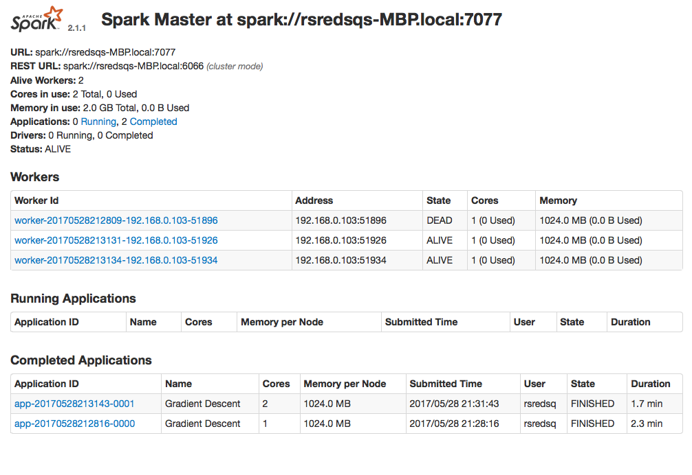
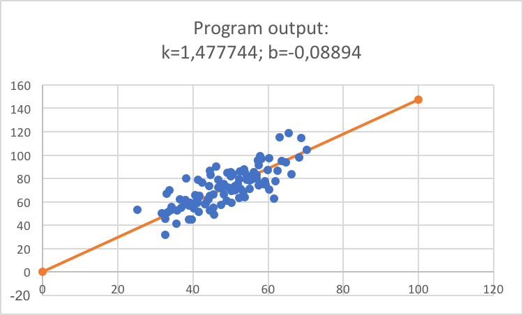

## Gradient Descent for Regression problem
This is a demonstration of solving regression problem(linear, quadratic) with gradient descent optimization.

## Execution
To run, package jar with `mvn package` then execute 

`spark-submit --class com.rsredsq.gradient_descent.GradientDescent --master <spark-url> spark-gradient-descent-1.0-SNAPSHOT.jar <file-path> <regression-type> <iterations-count> <learning-rate>`

`<regression-type> - 1 for linear, 2 for quadratic regression.`

## Horizontal scaling
I've made tests with 1 worker with 1 core and 1 GB RAM and with 2 workers with 1 core and 1 GB RAM per each.
Dataset was about 100mb.

2 workers shows better result.

## Algorithm correctness
`data.csv` is a test dataset with 100 points.

Program output for linear regression(`y=kx+b`) was `1,477744 -0,08894`

Graphical representation of output:

